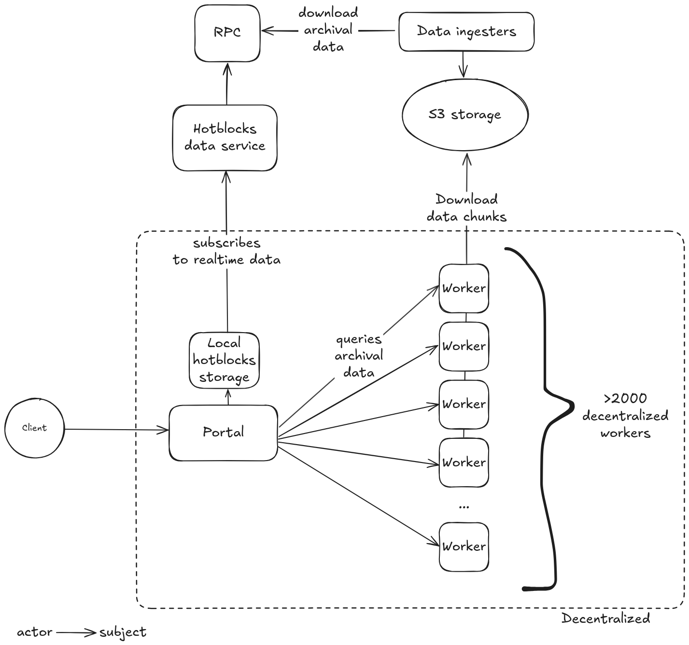

# What is Soldexer

Soldexer is a high-throughput data service for accessing Solana’s historical and real-time data. It processes 10MB+ per request with ~2-3 second latency, making it significantly faster than running your own node.

# Why Soldexer?

Unlike running your own decicated node (~$2k+/mo) or paying for proprietary APIs, Soldexer gives you scalable access, full filtering, and built-in transformations—at a fraction of the effort and cost.

# Development Status

Soldexer is under active development. Open Beta is coming soon.

# How It Works



1. **Client** sends a query to the Portal.
2. **Portal**:
   - Pulls recent data from local hotblocks storage.
   - Splits and routes historical data queries to decentralized workers.
3. **Hotblocks Data Service** streams live Solana data from RPCs into the Portal.
4. **Workers** fetch and return compressed historical data stored in S3.

# Related Repositories

| Name | Description |
|------|-------------|
| [solana-ingest](https://github.com/subsquid/squid-sdk/tree/master/solana/solana-ingest) | Extracts Solana data and uploads compressed chunks to S3. |
| [solana-data-service](https://github.com/subsquid/squid-sdk/tree/solana-data-service/solana/solana-data-service) | Streams live Solana blocks to Portals via RPC. |
| [sqd-portal](https://github.com/subsquid/sqd-portal) | Handles incoming queries and routes to workers or hotblocks. |
| [worker-rs](https://github.com/subsquid/worker-rs) | Decentralized worker that queries and serves data chunks from S3. |

# Example: Solana Swaps

```bash
# Install dependencies
yarn install

# Start ClickHouse
docker compose up -d

# Start the swaps indexer
yarn ts-node src/main.ts
